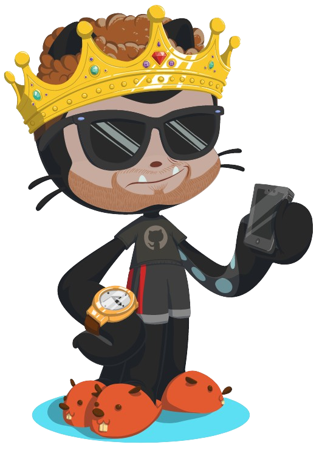

# Olá, Seja bem vindo ao meu perfil! :blue_heart:

  
**Sobre mim:**
* :man: 2000, São Paulo - SP, Ele/Dele
* :runner: Aluno em constante _Desenvolvimento_
* :dart: Futuro desenvolvedor Web Full Stack 

**Formações:**
* :school: Ensino Médio _(2017)_
* :mortar_board: SENAI Anchieta - Técnico em Eletrônica _(2017)_
* :computer: [Instituto PROA](https://www.proa.org.br/) - Desenvolvedor Web Full Stack _(2021)_

**Contato:**

---

### Estudando:

  
  
  
  
  
  
  

### Estudos Futuros:

  
  
  
  
  

 

---

 

  
 

 
