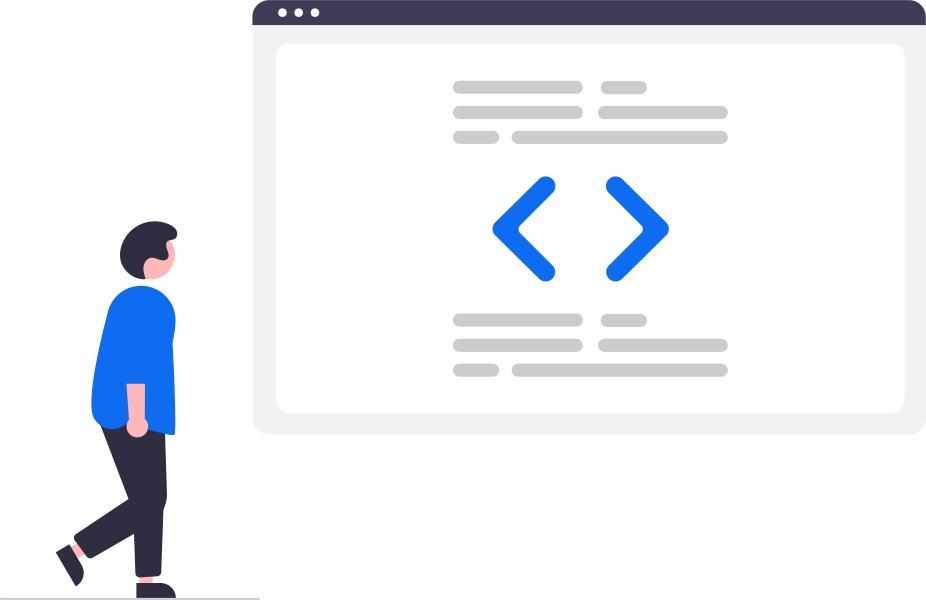

# Olá, bem vindo(a) ao meu perfil! :blue_heart

Aqui irei postar meus códigos enquanto sofro com js/ts e busco me tornar um dev *"fullstack"*, sinta-se a vontade para compartilhar meus projetos, abrir issues e enviar pull requests.

**Sobre mim:**

- :man: Ele/Dele
- :house: São Paulo - SP

**Formações:**

- Técnico em Eletrônica - SENAI Anchieta *(2017)*
- Desenvolvimento Web Fullstack - Instituto PROA *(2021)*

---

Atualmente focado em: **Desenvolvimento Frontend**

### Ferramentas e Técnologias

    
    
    
    
    
    

 

    
    

 

    
    
    

---

    
    

